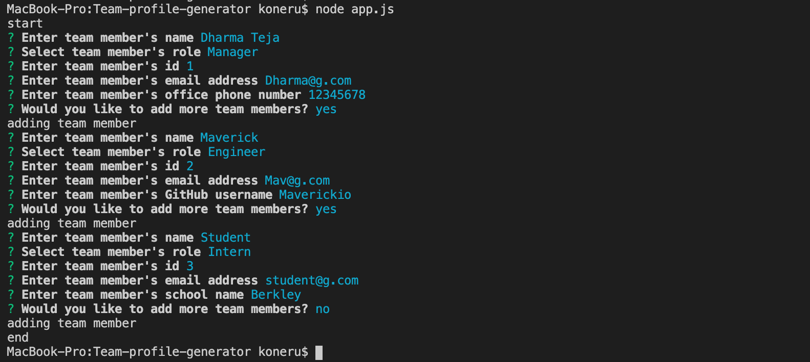
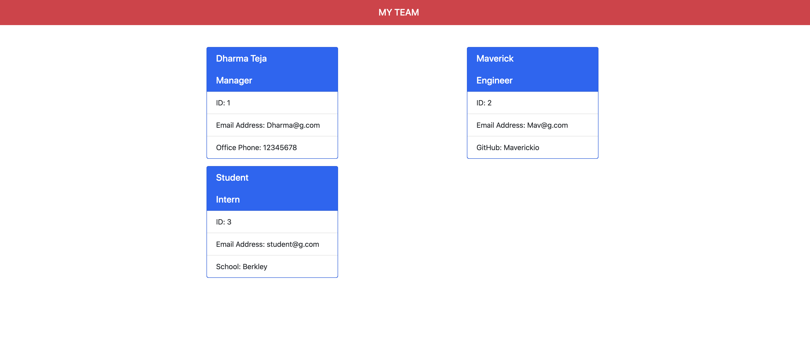

# Team-Profile-Generator / Org-Chart-Builder
This is a command-line-input application run in node that requests information about the team and then generates a html file describing about the team with cards for each member.

# User-Input-Questions
Run the application and then the user is asked to describe the first member of the team. The questions are prompted as follows
- NAME
- ROLE
- ID
- EMAIL ID
- GIT HUB USERNAME (if engineer was selected as role)
- SCHOOL NAME (if intern is selected)
- PHONE NUMBER (if manager is selected)

A screenshot showing an example user input is shown below:

After the information is entered, User can select the option as no for add any other team members. There is a team.html file that is generated in the output folder.

A screenshot of an example team profile is shown below:

# Technologies Used
This app was created using Object-Oriented Programming concepts, namely using classes and constructors to create "team member" objects based on information entered by the user.  The app is run using Node.js, and uses the "Inquirer" node module.  Files for different objects are also stored in separate .js files and passed among one another using module.exports.
